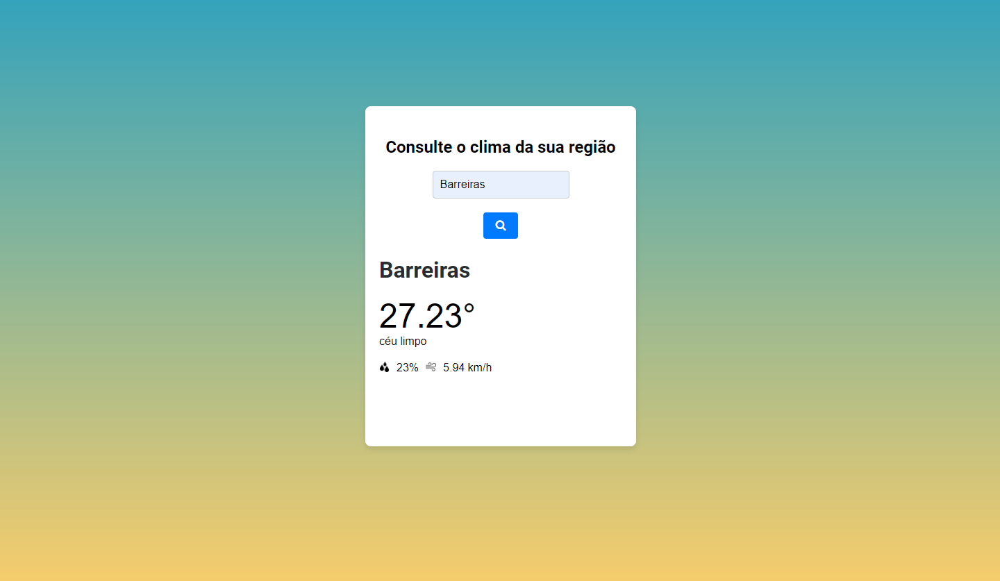

# Aplicação simples para consultar o clima de uma cidade

## Descrição
Uma aplicação web simples onde o usuario vai informar a cidade que deseja receber as informações meteorológicas e a aplicações vai fazer uma consulta na API e trazer as informações climaticas da determinada cidade.

## Instruções de Execução
1. Clone o repositório.
2. Navegue até o diretório do projeto.
3. Utilize a extensão live server do visual code para criar um servidor local.
4. No navegador de sua preferencia informe o endereço do servidor local e a pasta index. EX: http://127.0.0.1:5500/index.html

## Tecnologias Utilizadas
- HTML
- CSS
- TypeScript

## Possíveis Melhorias Futuras
- Adicionar determinadas cores para cara clima, trazendo uma experiencia mais imersiva ao usuario.
- Implementar funcionalidade de previsões climaticas em um determinado periodo.
- Incluir historico de consultas e informações mais detalhadas como o nome do pais e etc.

# Ctt

Qualquer ideia construtiva ou duvidas para a exercusão do projeto, pode entrar em contato

Email: marcosifba01@gmail.com
Tell: (77) 998441226

Att. Marcos Vinícius